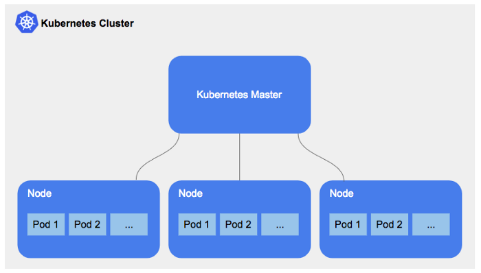

# Kubernetes (k8)

- orchestration platform, controls behaviour of multiple containers
- where `docker compose` runs a few container, Kubernetes manages 100s/1000s
- can deploy multiple copies, load balance, self healing (manages containers going down automatically) 
- open sourced by google so publically available, used by ~70% of surveyed organisations in 2017
- other cloud providers (Azure, google cloud, AWS) run kubernetes based services as well
- managed services: resources managed by responsible team, can be interface or command line
- create a kubernetes cluster - platform to manage multiple running containers, e.g. docker containers
- advantages: self heal (auto spin up instance to replace any that go down), load balance between instances while self healing is performed, automated rollouts/rollbacks between working versions, auto scaling and bin packing, storage orchestration
- deployment of replica sets, snapshots of same image and each pod has individual IP for connections/API
- what problems, what challengs, what skillset, comms between tech/non tech - FA webinar
- challenge: already using microsft languages/service (azure, .net frameworks) so not compatible with k8 version
- analysts find it useful knowing the terms/processes for better understanding but havent always heard of the tech
- people dont always have the latest tech knowledge
- kubernetes can be expensive for smaller solutions, and needs prior understanding of containers, networking etc
- provider managed k8 services manage the master node for you, so there is no provisioning needed for the master node on launch, and managed services can vary from different providers
- in a self managed service there is more control over the cluster control, and can manage each layer component individually. there is also more control over deployment and administration of the clusters
- `kubectl help` will show a list of commands with explanations

## Setup
- after starting docker navigate to settings -> kubernetes and ensure it is enabled
- `kubectl` will give commands available and check if install was correctly done, and default clusters can be seen in the docker app
- `kubectl get service` or `svc` will show the running services with info
- `kubectl get` can be `name_of_resource`, `node`, `pods`
- can use `kubectl describe pod_id` to see what is inside a pod, which are similar to containers
- can use docker desktop to view more container details and see what is running
- By default the type of the service is cluster, LoadBalancer and NodePort are used for public access
- can use `kubectl scale deploy deployment-name --replicas=5` for example, to scale up to 5 pods
- to auto scale deployment on demand we need to declare a minimum and maximum number of pods
- create a file/add to file with --- separator and declare variables for min/max and conditions for scaling
- `kubectl get hpa` will show the details and conditions for the auto scaling

## Prerequisites/task
- ensure all required ports for app are available - 3000, 80 and 27027 for sparta node app
- create k8 deployment file called nginx_deployment.yml
- use default nginx image - can use production ready image for node app
- create 2 replicas of this deployment
- `kubectl create -f file_name.yml` will run the deployment file
- `kubectl get deployment` or `deploy` will list what has been deployed and is running
- `kubectl get pods` will now display each replica
- to launch deployment to public browser we need to create `nginx_service.yml` to connect with deployment
- run this service file with same `create` command, and nginx server is now available on localhost
- `kubectl edit deploy nginx-deployment` opens notepad to live edit (vi editor) the deployment file, which has been added to by k8
- `kubectl delete pod pod_id` will delete pods, k8 will redeploy pods with self healing - i.e. if there are 3 and one is deleted/goes down, k8 will load balance while recreating it
- `kubectl edit svc nginx-deployment` will open editing for the service 
- load balancer, cluster ip or node ports can be used for services
- `kubectl delete deploy nginx-deployment` and `kubectl delete svc nginx-deployment` are used to get rid of a service and its pods

